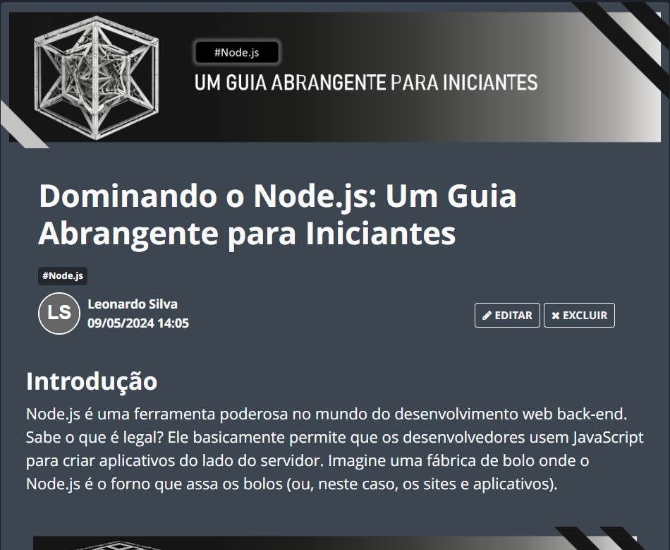

    

  
  

-------

  

# Projeto artigo técnico gerado por I.A.s

 > ℹ️ **NOTE:** Este é o repositório desenvolvido durante o curso no qual fui instrutor técnico na plataforma da [DIO](https://dio.me).

  

Projeto com o objetivo de gerar um artigo técnico com um layout rico, leitura agradável e com foco em promover sua autoridade técnica.

<a href="https://web.dio.me/articles/dominando-o-nodejs-um-guia-abrangente-para-iniciantes?back=%2Farticles&open-modal=true&page=1&order=oldest" title="View PDF now"> 📕Clique aqui para ler o artigo</a>

## 💻 Tecnologias utilizadas no projeto

- [ChatGPT](https://chat.openai.com/) - para título e conteúdo
- [Lexica.art](https://lexica.art/) - para gerar imagens
- [PowerPoint](https://www.microsoft.com/en/microsoft-365/powerpoint) - Para formatação de banners e Layouts

## 📄 Prompts e ferramentas

ChatGPT：

|   Ação   | prompt                                                                                                                                                                                                                                                                         |
| :------: | ------------------------------------------------------------------------------------------------------------------------------------------------------------------------------------------------------------------------------------------------------------------------------ |
|  título  | crie 10 headlines para nomes de artigos sobre assunto de Node.js                                                                                                                                                                                                    |
| conteúdo | Comporte-se como um escritor de artigo de tech back-end e escreva o Artigo seguindo as {Regras} No máximo 5 linhas por parágrafo. Me explique de maneira informal, como se eu fosse uma pessoa sem conhecimento algum em linguagens de programação |

Lexica.art：

- No léxica utilizamos o acervo público de imagens geradas por outras pessoas, os termos de pesquisa que utilizei durante a gravação do conteúdo foram:

• Node

## ✨ Features

- Conteúdo gerado via ChatGPT
- Imagens do acervo público geradas via Lexica.art

## 📚 Materiais

- prompts utilizados

## 🛠️ Instruções de execução

Utilize os prompts acima nas ferramentas sugeridas para gerar o material base e utilize uma ferramenta de edição de documentos como power point, libreoffice , indesign para diagramação, o passo a passo em vídeo pode ser conferido na plataforma da [DIO](https://dio.me).

## 👨‍💻 Desenvolvedor

    
    
&nbsp&nbsp&nbspLeonardo Lopes 
    &nbsp&nbsp&nbsp
    <a href="https://www.github.com/do-Lopes">
    GitHub</a>&nbsp;|&nbsp;
    <a href="https://www.linkedin.com/in/
leonardo-lopes-8a38a3215/">LinkedIn</a>
&nbsp;|

